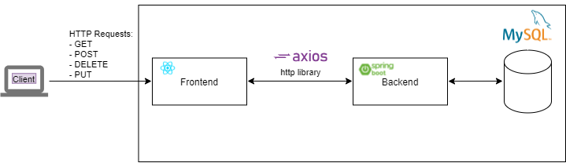

# Student Record App

The application is designed to perform basic CRUD operations with student records using Spring Boot, Spring Data JPA and MySQL. It is possible to add, update, and delete students.    

## Technologies Used
   :white_check_mark: Java 8+.  
   :white_check_mark: Spring Boot.  
   :white_check_mark: Spring Data JPA (Hibernate).  
   :white_check_mark: MySQL Database.  
   :white_check_mark: Maven.  
   :white_check_mark: React JS.  
   :white_check_mark: Axios HTTP library.  
   
   
## High-Level Architecture

   

## Application Interface

   

